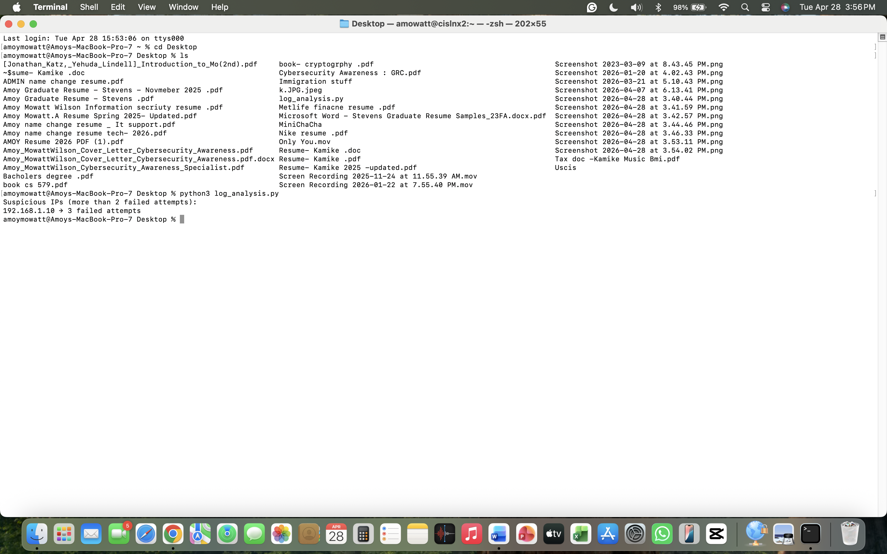

# Mini SOC Lab - Splunk Log Analysis

## Overview
This project demonstrates basic SOC analyst skills using Splunk to analyze log data and detect suspicious activity.

## Objective
- Ingest logs into Splunk
- Search and analyze logs
- Detect failed login attempts
- Identify potential brute-force attacks

## Tools Used
- Splunk Enterprise
- Sample logs
- SPL (Search Processing Language)

## Detection Example
"failed password" | stats count by src_ip

## What I Did
- Uploaded logs into Splunk
- Searched for failed login attempts
- Identified suspicious IP activity
- Documented findings

## Screenshots

The script identified suspicious activity:
- 192.168.1.10 → 3 failed login attempts

This demonstrates the ability to analyze logs and detect potential brute-force attacks using Python.

## Conclusion
This project shows how log analysis can be used to detect potential security threats.
